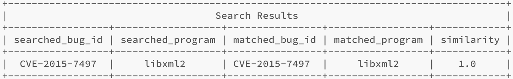
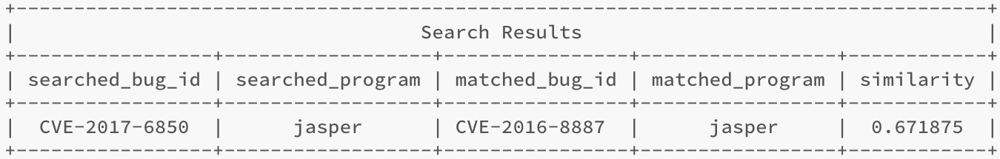

# CrashSearch
We designed CrashSearch for the specific purpose of efficiently mapping a reported bug to related known bugs within a bug datastore, including both exact and inexact duplicates. CrashSearch uses the symptoms of a crash to create a fingerprint that it uses to search for bugs with similar behaviors, and leverages sequential pattern mining to effectively showcase relationships among duplicate bugs.

### Feature Extraction
Given a vulnerable program and a POC input, we use the `reproduction_oracle.py` script to extract the features. As an example, we can extract features for the bug `CVE-2015-7497` by first building the `libxml2-2.8.0` binary in the data folder by executing the `make-asan.sh` script. Next, execute `python reproduction_oracle.py --asan data/CVE-2015-7497.json`. The `--asan` flag tells the reproduction_oracle to use AddressSanitizer to reproduce the bug and the `CVE-2015-7497.json` is a job file that provides the reproduction oracle with the necessary information to reproduce and describe the bug.

### Insertion
To insert fingerprints, execute `python crash_search.py --insert <reference_file.csv>` where the `reference_file.csv` is the CSV file containing the reference signatures. As an example, we can insert the references from the `reference-bugs.csv` file available in the `data` folder by executing `python crash_search.py --insert data/reference-bugs.csv` 

### Query
Once the reference signatures have been inserted, we can query the datastore for duplicate bugs. To do so, fingerprints, execute `python crash_search.py --search <query_file.csv> --bug <bug id> --tresh <similarity threshold>`. The `query_file.csv` is the CSV file containing the query signatures, `bug` is the name of a bug id in `query_file.csv`  and the similarity threshold is the desired similarity threshold which is used as a filter. As an example, we can insert the references from the `reference-bugs.csv` file available in the `data` folder by executing `python crash_search.py --insert reference-bugs.csv`. As an example, executing ` python crash_search.py --search data/query-bugs.csv --bug CVE-2015-7497 --tresh .90` returns an exact match for `CVE-2015-7497` as seen below.
<!--  -->

Similarly, executing `python crash_search.py --search data/query-bugs.csv --bug CVE-2017-6850 --tresh .60` retrieves the inexact duplicate `CVE-2016-8887` for jasper.

<!--  -->

### Group Analysis
Given the inexact duplicate found by querying `CVE-2017-6850` for jasper, we can leverage BIDE to analyze the shared sequences among their stack backtraces by executing the command `python crash_search.py --rel ./query-bugs.csv-bide.csv --bug CVE-2017-6850`. This produces two assets, a `query-bugs-bide.json` report file and a `CVE-2017-6850-BIDE-Relationship.png` which shows the directed graph with the query bug and shared sequence.

